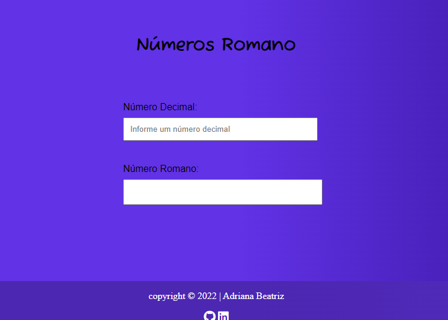
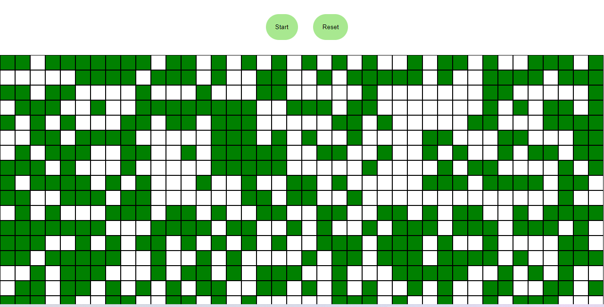
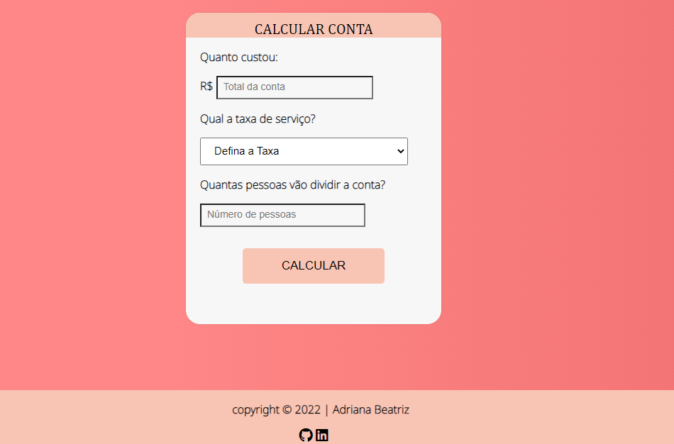

<h1 align="center"> Teste de programação </h1>

<h3 align="center"> Desafio 01 - Conversor de números romanos </h3>

    

<a href="https://blog1-db.vercel.app/">Clique aqui</a> para ver o projeto.

## 
<h3 align="center"> Desafio 02 - Jogo da vida </h3>

    

<a href="https://aviagem-db.vercel.app/">Clique aqui</a> para ver o projeto.

<h3 align="center"> Desafio 03 - Divisor de conta de restaurante </h3>

    

<a href="https://aviagem-db.vercel.app/">Clique aqui</a> para ver o projeto.

##

 
 Made with ♥ by Adriana Beatriz. 

